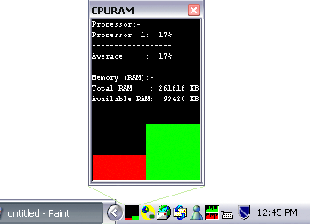



## A       Animated CPU & RAM usage system tray graph, real time

### Description

This is nothing revolutionary, just puts a real time CPU & RAM usage meter in you your system tray. I found solutions of animated system tray example a lot but they are not completely dynamic like this one, it doesn't have an image library rather it generates the image dynamically and gets you the accurate graph display, could be a good example of animated system tray icon!
 
### More Info
 
Didn't find any!

             |
---                |---
**Submitted On**   |2002-11-04 12:24:42
**By**             |[Broken Arrow](https://github.com/Planet-Source-Code/PSCIndex/blob/master/ByAuthor/broken-arrow.md)
**Level**          |Intermediate
**User Rating**    |4.4 (53 globes from 12 users)
**Compatibility**  |VB 6\.0
**Category**       |[Complete Applications](https://github.com/Planet-Source-Code/PSCIndex/blob/master/ByCategory/complete-applications__1-27.md)
**World**          |[Visual Basic](https://github.com/Planet-Source-Code/PSCIndex/blob/master/ByWorld/visual-basic.md)
**Archive File**   |[CPURAM1492681152002\.zip](https://github.com/Planet-Source-Code/broken-arrow-a-animated-cpu-ram-usage-system-tray-graph-real-time__1-40453/archive/master.zip)

